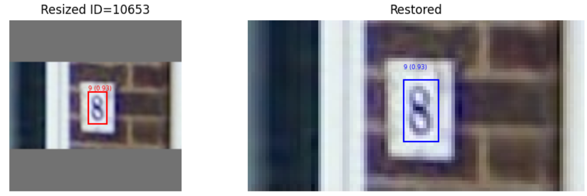
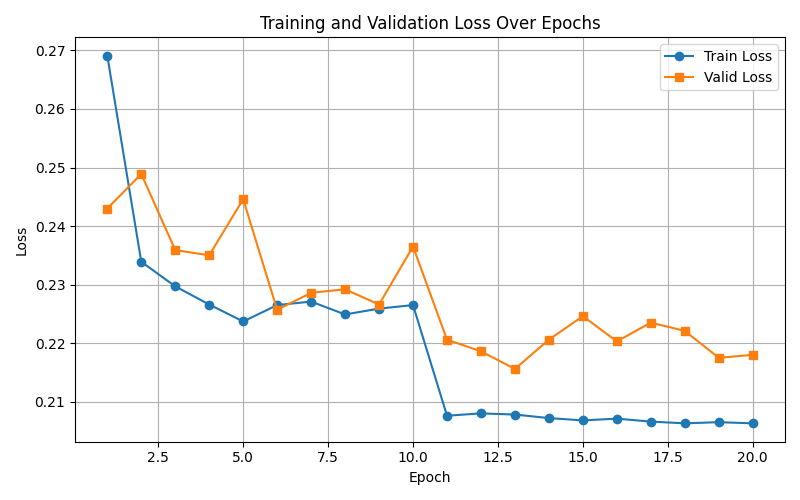
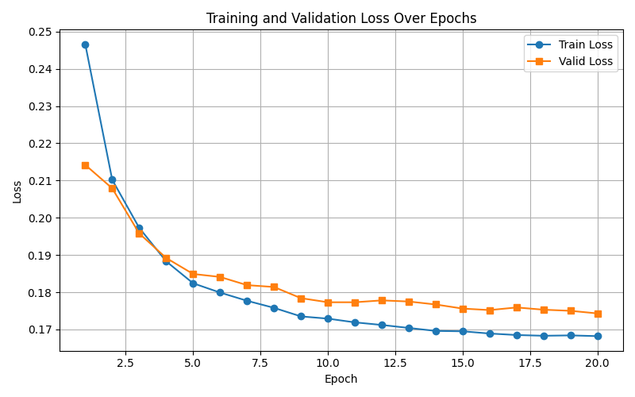
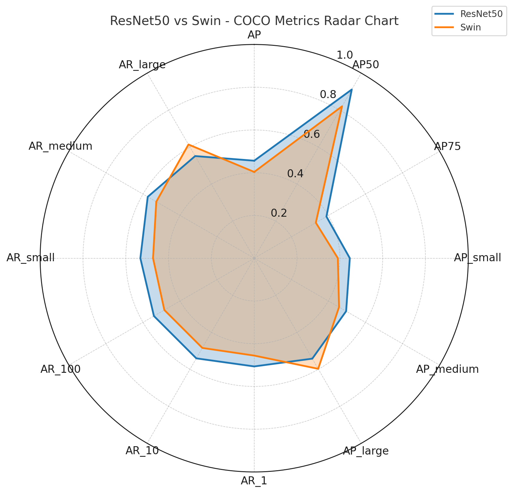
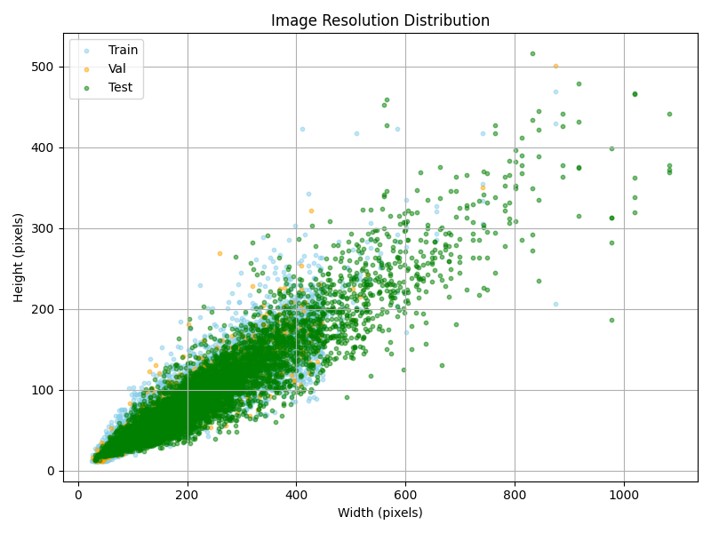
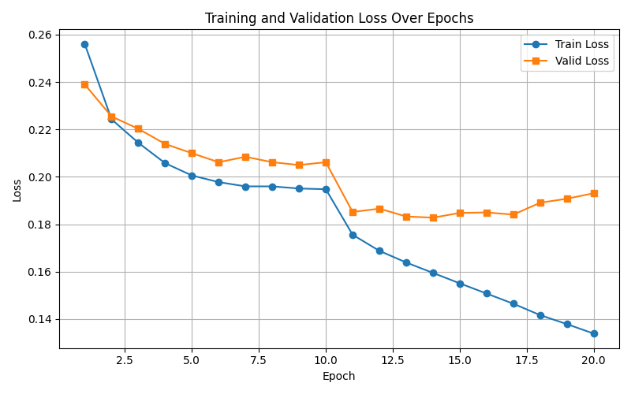
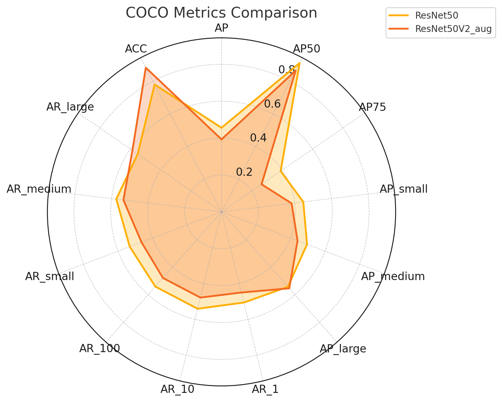

# Selected Topics in Visual Recognition using Deep Learning HW2 Report

- **Name:** 袁孟華
- **Student ID:** 110550004
- **Github Repo:** <https://github.com/mm1719/CV_DL>

## How to run

`>./run.sh` includes all training, testing, and evaluation phases. After all the procedures of one experiment are done, the result would store in `outputs/` with this sort of structure:

```txt
.
|
`-- 20250412-004325                 # starting timestamp
    |-- best_model.pth              # model weights
    |-- log_20250412-004329.txt     # training log
    |-- pred.csv                    # prediction in csv format
    |-- pred.json                   # prediction in coco json format
    |-- tensorboard                 # tensorboard record
    |-- val_metrics.txt             # evaluation results
    |-- val_pred.csv                # validation in csv format
    `-- val_pred.json               # valudatoin in coco json format
```

Or you can run each phases seperately by following the format provided in `run.sh`.

## Introduction

This report detailed introduce most the tactics I have attempted to improving the performance of a Faster RCNN model on digits detection problem. Overall, the venture was full of twins and turns. Due to the limited time and hardware resources, my experiments mainly focused on preprocessing of data and alteration of the RCNN backbone. For better description, I would explain the backbone part first.

## Method

Aside from backbone selection and image preprocessing:

- Model Architectures
  - RPN (neck of Faster RCNN)
  - classification heads: 1 (background) + 10 (0~9) = 11 heads
- Training Hyerparamerter
  - ResNet50
    - epoch: 20
    - lr: 5e-3
    - batch size: 4
    - optimizer: SGD
    - schedular: stepLR
      - step size: 10
      - gamma: 0.1
      - weight decay: 5e-4
    - patience: 6
  - Swin-V2-base
    - epoch: 20
    - lr: 1e-4
    - batch size: 2
    - optimizer: AdamW
    - schedular: CosineAnnealingLR
      - gamma: 0.1
      - weight decay: 5e-4
    - patience: 6

### Backbone

Backbone in Faster R-CNN is for initial feature extraction. **ResNet50** and **Swin-V2-Transformer** was seleted for comparison. For ResNet50, I used `fasterrcnn_resnet50_fpn` and its pretrained weights from PyTorch. As for Swin-V2, I downloaded `swinv2_base_window8_256` from timm with its pretrained weights as well.

`fasterrcnn_resnet50_fpn` has already included not just the backbone but the whole Faster R-CNN model. On the other hand, the whole "fasterrcnn swin fpn" need to built up one by one, from backbone, fpn, to rpn.

### Data Preprocessing

To cater the necessity of different model, especially the input size, data preprocess is necessary. The input image size for these 2 models are pretty different.

#### ResNet50 as backbone

`fasterrcnn_resnet50_fpn` imports a built-in object called `GeneralizedRCNNTransform` that would help developers to proportionally scaling the image.

```python
"""
...
    min_size (int): Images are rescaled before feeding them to the backbone:
        we attempt to preserve the aspect ratio and scale the shorter edge
        to ``min_size``. If the resulting longer edge exceeds ``max_size``,
        then downscale so that the longer edge does not exceed ``max_size``.
        This may result in the shorter edge beeing lower  than ``min_size``.
    max_size (int): See ``min_size``.
...
"""
...
transform = GeneralizedRCNNTransform(min_size, max_size, image_mean, image_std, **kwargs)
```

- The default `mean_size` and `max_size` are 800 and 1333.

- This built-in convenient also includes auto-transform of bounding-boxes in COCO JSON format.

#### Swin-V2-base as backbone

`swinv2_base_window8_256` on the other hands, needs to handmade the transform for both images and bounding-boxes. Also, unlike `fasterrcnn_resnet50_fpn`'s flexibility, Swin-V2 has stricter condition on windows size and patch partition, resulting in limited inut size. For instance, `swinv2_base_window8_256` only accepts images with size 256 x 256.
To address this issue, I have implemented a method to proportionally rescale the images then padding. A visualize example is shown below.


The left side includes resized image with resized bounding-box, while the restored one is at right.

## Result

### Training Curve

ResNet50:


Swin-V2-base:


### COCO Evaluation (on Val Set)

Seems like Swin-V2-backbone has stable training process and smaller loss. However, at COCO evaluation aspect, ResNet50-backbone is better.



Moreover, ResNest50-backbone outperformed on testing leader board than Swin-V2-backbone.

| Model backbone  | ACC   | mAP   |
| :---            | :---  | :---  |
| ResNet50        | 0.72  | 0.38  |
| Swin-V2         | 0.51  | 0.28  |


### My Assumption

Mathematically, lower loss does not directly lead to higer accuracy or mAP. Nevertheless, the poor performance of Swin-V2-backbone made me wonder that the difference of backbone structure might be the main reason. (Ignore that I might made mistakes on implementation.)

Obviously, one of the main difference is the input size of images. The scale between 800 (or 1333) and 256 is way too large. Thus, I tidy up a scatter plot showing the height and width of the every images.



According to this plot, there is a huge ratio of images larger than 256 x 256. If an image is narrowed, some detail features would loss, causing lower accuracy on classification. Additionally, re-amplifying shriken images would make the error of bounding-box-regression larger, resulting in lower mAP. Considering the limited time and hardware resources, I did not do any further research.

## Additional Experiments

### Model Upgrade and Data Augmentation

After browsing the document about Faster R-CNN on Pytorch website, I upgrade `fasterrcnn_resnet50_fpn` to `fasterrcnn_resnet50_fpn_v2`. The upgraded one has some imporvement including:

- `BatchNorm` is trainable.
- COCO-pretrained instead of merely pretrained on ImageNet.

Since previous experiment shown that ResNet50-backbone performs better, I eventually focussed on bettering `fasterrcnn_resnet50_fpn_v2`. One of the simle way to improve is data-augmentation. I only chose `ColorJitter` for:

- Rotation and Flipping require re-calculating bounding-boxes, which is a bit tricky.
- Reflection affects digit classification.
- Most of the original images are way smaller than the input size of `fasterrcnn_resnet50_fpn_v2`, so the resized images is already blurred. Thus, I decided not to use `GaussianBlur`.
- `ColorJitter` does not have these problems.

The training curve and testing performance of `fasterrcnn_resnet50_fpn_v2` with `ColorJitter` is shown below.




| Model backbone        | ACC   | mAP   |
| :---                  | :---  | :---  |
| ResNet50(original)    | 0.72  | 0.38  |
| ResNet50(v2 w/. aug.) | 0.82  | 0.38  |

This result gives me an interesting insight that changing the color of images can better the accuracy. However, since the bouding-boxes remains unchanged, the mAP still remains the same.

## Reference

- [Torchvision SSD Implementation](https://pytorch.org/blog/torchvision-ssd-implementation/#ssd-algorithm)

- [Faster R-CNN](https://pytorch.org/vision/main/models/faster_rcnn.html)

- [transform.py](https://github.com/pytorch/vision/blob/33db2b3ebfdd2f73a9228f430fa7dd91c3b18078/torchvision/models/detection/transform.py#L64)

- [faster_rcnn.py](https://github.com/pytorch/vision/blob/main/torchvision/models/detection/faster_rcnn.py)

- [Faster R-CNN: Towards Real-Time Object Detection with Region Proposal Networks](https://arxiv.org/abs/1506.01497)

- [Benchmarking Detection Transfer Learning with Vision Transformers](https://arxiv.org/abs/2111.11429)

- [swinv2_base_window8_256](https://huggingface.co/timm/swinv2_base_window8_256.ms_in1k)

- [Swin Transformer论文精读【论文精读】](https://www.youtube.com/watch?v=luP3-Fs0QCo&t=392s)

- [Swin Transformer v2（基于base规模的模型）](https://www.atyun.com/models/info/microsoft/swinv2-base-patch4-window16-256.html)

- [mean Average Precision (mAP) — 評估物體偵測模型好壞的指標](https://medium.com/lifes-a-struggle/mean-average-precision-map-%E8%A9%95%E4%BC%B0%E7%89%A9%E9%AB%94%E5%81%B5%E6%B8%AC%E6%A8%A1%E5%9E%8B%E5%A5%BD%E5%A3%9E%E7%9A%84%E6%8C%87%E6%A8%99-70a2d2872eb0)

- [Swin Transformer: Hierarchical Vision Transformer using Shifted Windows](https://arxiv.org/abs/2103.14030)

- [【pytorch】常用图像处理与数据增强方法合集（torchvision.transforms）](https://blog.csdn.net/qq_42951560/article/details/109852790)
