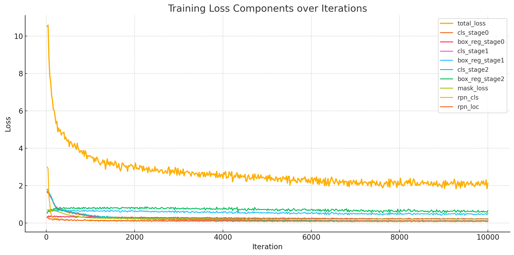

# Selected Topics in Visual Recognition using Deep Learning HW3 Report

- **Name:** 袁孟華
- **Student ID:** 110550004
- **Github Repo:** <https://github.com/mm1719/CV_DL>

## How to run

### Train

`>./run.sh train default` or `>./run.sh train weakly` includes all training and evaluation phases. After the training procedures of one experiment are done, the result would store in `outputs/` with this sort of structure:

```txt
.
├─20250506-204058
│  │  config.yaml             # Detailed setup for one training
│  │  events.out.tfevents.*   # Tensorboard event file
│  │  last_checkpoint         # Name of the last checkpoint model
│  │  log.txt                 # Log file
│  │  metrics.json            # Detailed metrics for every 20 epochs
│  │  model_0000999.pth       # Model stored in the i-th epochs, and so on
│  │  model_0001999.pth
│  │  model_0002999.pth
│  │  model_0003999.pth
│  │  model_0004999.pth
│  │  model_0005999.pth
│  │  model_0006999.pth
│  │  model_0007999.pth
│  │  model_0008999.pth
│  │  model_0009999.pth
│  │  model_final.pth         # Model stored in the last epoch
│  │  run.log                 # Log file
│  │
│  └─inference                                # Evaluation results
│          cells_val_coco_format.json         # Validation ground truth in COCO format
│          coco_instances_results.json        # Prediction for val set in COCO format
│          instances_predictions.pth          # Inference results in Python pickle
```

### Test

Any trained model can be picked for testing by `>./run.sh test /path_to_a_model`

- e.g.`>./run.sh test outputs/20250506-204058/model_0007999.pth`

After the testing procedures of one experiment are done, the result would store in `outputs/` with this sort of structure:

```txt
├─20250507-053814
│      log.txt              # Log file
│      run.log              # Log file
│      submission.zip       # Testing results for direct submission
│      test-results.json    # Testing results in COCO format
```

## Introduction

This report detailed mentioned the 2 experiments I conducted for instance segmentation via **Mask R-CNN**. The 2 methods are mostly indentical, while the major difference is introducing the **Weakly Supervised w/. MIL Loss** learnt in the class. Unfortunaltely, due to the lack of time and experience (debugging caused me more than a weak), I did not fine tune the hyperparameters for better performance. Eventually, the performances of these 2 have equal shares, but the one w/. weakly supervised is much more economical. All the experimental procedures is written under Detectron2 framework.

## Method

### Data Preprocess

Considered the `example.ipynb` and `utils.py` given by TAs, I implemented `dataloader/dataloader.py` and `utils/encode.py` for register COCO JSON data for Detectron2 framework. The JSON attributes includes "segmentation", "bbox", "category_id", etc.

### Model Architecture

For default settings, I used **Cascade Mask R-CNN**, which is an advanced model architecture of Mask R-CNN. I chose "cascade_mask_rcnn_R_50_FPN_3x" since it has parameters less than 200M.

### Hyperparameters

Detailed setting can be found in `outputs/timestamp/config.yaml`:

```text
SOLVER:
  AMP:
    ENABLED: false

  BASE_LR: 0.0001

  BIAS_LR_FACTOR: 1.0

  CHECKPOINT_PERIOD: 1000

  CLIP_GRADIENTS:

    CLIP_TYPE: value

    CLIP_VALUE: 1.0

    ENABLED: false

    NORM_TYPE: 2.0

  GAMMA: 0.1

  IMS_PER_BATCH: 4

  LR_SCHEDULER_NAME: WarmupMultiStepLR

  MAX_ITER: 10000

  MOMENTUM: 0.9

  NESTEROV: false

  REFERENCE_WORLD_SIZE: 0

  STEPS:

  - 7000

  - 9000

  WARMUP_FACTOR: 0.001

  WARMUP_ITERS: 1000

  WARMUP_METHOD: linear

  WEIGHT_DECAY: 0.0001

  WEIGHT_DECAY_BIAS: null

  WEIGHT_DECAY_NORM: 0.0
```

## Result

Training Curve:



AP:


## Additional Expirements and Results

As I mentioned above, I tried to use **Weakly Supervised w/. MIL Loss** with "mask_rcnn_R_50_FPN_3x.yaml" mentioned in the course, thus I implemented `dataloader/coco_mil_dataloader.py` and `utils/mil_loss.py` for bounding-box-only data and MIL loss function implementation.

The result seems pretty similar to the default one, but the training time is a bit faster (2 minutes per 1000 epochs).

## Reference

1. **Detectron2**: Wu, Y., Kirillov, A., Massa, F., Lo, W. Y., & Girshick, R. (2019). Detectron2. _GitHub repository_. [https://github.com/facebookresearch/detectron2](https://github.com/facebookresearch/detectron2)
2. **Cascade R-CNN**: Cai, Z., & Vasconcelos, N. (2018). Cascade R-CNN: Delving into High Quality Object Detection. _Proceedings of the IEEE Conference on Computer Vision and Pattern Recognition (CVPR)_.
3. **Feature Pyramid Networks (FPN)**: Lin, T. Y., Dollár, P., Girshick, R., He, K., Hariharan, B., & Belongie, S. (2017). Feature Pyramid Networks for Object Detection. _Proceedings of the IEEE Conference on Computer Vision and Pattern Recognition (CVPR)_.
4. **Weakly Supervised with MIL Loss**: Cheng-Chun Hsu, Kuang-Jui Hsu, Chung-Chi Tsai, Yen-Yu Lin, Yung-Yu Chuang. (2019). Weakly Supervised Instance Segmentation using the Bounding Box Tightness Prior.